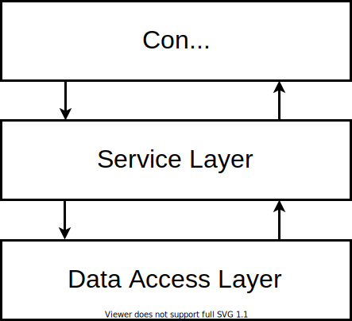

# NestJS Practice Project (Rest API on memory - array - and Swagger)

- [Description](#description)
- [Installation](#installation)
- [Running the app](#running-the-app)
- [Test](#test)
- [My notes](#my-notes)
  - [Create the Project](#create-the-project)
  - [Start it in Dev mode (watch, like `nodemon`):](#start-it-in-dev-mode-watch-like-nodemon)
  - [The files](#the-files)
  - [Architecture](#architecture)
  - [The Decorator emphasis](#the-decorator-emphasis)
  - [Creating new endpoints](#creating-new-endpoints)
  - [Dependency Injection](#dependency-injection)
  - [Body Parsing, DTOs and Entities](#body-parsing-dtos-and-entities)
    - [`@Body()` decorator](#body-decorator)
  - [Installing SwaggerAPI](#installing-swaggerapi)
  - [Parsing out Query Params (`localhost:3000/users?name=Marius`)](#parsing-out-query-params-localhost3000usersnamemarius)
  - [Exception and Error handling](#exception-and-error-handling)
  - [Pipes](#pipes)
  - [Using the CLI to generate CRUD](#using-the-cli-to-generate-crud)

## Description

- This is a [NestJS](https://github.com/nestjs/nest) practice project I've used to study following the [NestJS Crash Course: Everything you need to know! | NodeJS Tutorial 2021 by Marius Espejo](https://www.youtube.com/watch?v=2n3xS89TJMI), this project consists of:

  - [NestJS](https://github.com/nestjs/nest)
  - No database, just in memory data.
  - [SwaggerAPI](https://docs.nestjs.com/openapi/introduction)(OpenAPI)

## Installation

```bash
$ npm install
```

## Running the app

```bash
# development
$ npm run start

# watch mode
$ npm run start:dev

# production mode
$ npm run start:prod
```

## Test

```bash
# unit tests
$ npm run test

# e2e tests
$ npm run test:e2e

# test coverage
$ npm run test:cov
```

# My notes

## Create the Project

- Create new NestJS project:

  ```sh
  nest new nestjs-crash-course-mario-espejo
  ```

- It's going to be a `src` directory with our files.

- It's going to be a `package.json` file that will include the scripts that we can run

## Start it in Dev mode (watch, like `nodemon`):

- So we run `npm run start:dev`

- Now when we go to `http://localhost:3000` we should see a `'Hello World'`.

## The files

- Within our `src` directory we should see a `main.ts`
  - The `main.ts` is sort of the very root entrypoint of our application
  - It just says it's creating an app and it's listening on port 3000.
  - We can also see it's `.create`ing from this `AppModule`.
- When we click into that `AppModule` we are taken to `app.module.ts`
  - The `app.module.ts` has a `controllers` and a `providers` array.
    - The `controllers` array has `AppController`
    - The `providers` array has `AppService`

## Architecture

- Before we go any depeer, let's first talk about architecture.
- One of the big things with NestJS is it tries to promote a specific convention for Artchitecture that we should follow: the 3 layer architecture and there's actually a good article called ['Bulletproof node.js project architecture' by Sam Quinn](https://dev.to/santypk4/bulletproof-node-js-project-architecture-4epf).
- And there's a section in this article where he talks about the 3 layer architecture:

  

- The basic idea is that there's these 3 core parts to handling API requests:

  - There's the `controller`
  - There's the `service` layer
  - There's the data access layer

- So as we see in the code, NestJS directly maps into that idea.

  - There's a `controller`: `AppController`
  - There's a `service`: the `AppService` from `app.service.ts`
  - And within the `AppService`, there's nothing in there yet but in the future if we were to incorporate a database connection, theat's where our **Data Layer** will be. There will be a repository that connects to our database and that's what the `AppService` is going to do.

- The only thing that we need to understand is that NestJS by default has this artchitecture that tries to promotes a pattern where a specific things that are in charge of specific topics. Separation of concerns.

- So we got a `Controller` that's in charge of things like anything related to http, our URLs, our endpoints, http verbs like `Get`, `Post`, `Put`, `Delete`, HTTP Exception Handling like when our API responds `200 Ok`, `404 Not Found`, `500 Internal Server Error`, stuff like that, that's usually things that the `Controller` would be doing.

- The `Service` layer is going to have all of our business logic, so any logic that happens between all of that HTTP stuff as well as before it gets saved or updated in our database

- And obviously the **Data Access Layer** is our database logic, a lot of the quyering is going to be handled by that.

## The Decorator emphasis

- There is decorators everywhere and we will see this a lot in NestJS, there's a heaby emphasis on sort of configuring things via decorators.

- There's a couple of things we can do, for instance, in `app.controller.ts`, this `@Controller()` decorator accepts a `String` so if we change this:

  #### **`app.controller.ts`** (partial)

  ```js
  @Controller()
  export class AppController {}
  ```

- To this:

  #### **`app.controller.ts`** (partial)

  ```diff
  +@Controller('app')
  export class AppController {}
  ```

- Now if we refresh our application now under `http://localhost:3000` we will get a 404 error.

- Now our `'Hello World'` (the root for our project) is only going to work at `http://localhost:3000/app` and not at the root level (`http://localhost:3000`) anymore.

- Next, within the `@Get()` method decorator, that also accepts a string.

## Creating new endpoints

- We will open a new terminal and we will use the Nest CLI and we will do:

  ```sh
  nest generate module users
  ```

- So this created and updated the following:

  ```
  CREATE src/users/users.module.ts (82 bytes)
  UPDATE src/app.module.ts (312 bytes)
  ```

- Modules in NestJS are kind of a **grouping entity** where we will kind of have different domains in our application, so for example a Pet Store API might have a module for dogs, it might also have a module for cats, a module for owner and so on. Think aobut the different domains that we might have, we will likely have a module for that.

- So in our case we just created a new module for Users.

- We will realize that inside `app.module.ts` our `@Module()` got automatically updated and now has this `imports` in it:

  #### **`app.module.ts`** (partial)

  ```diff
  @Module({
  +  imports: [UsersModule],
    controllers: [AppController],
    providers: [AppService],
  })
  ```

- So that's another reason why we want to use the CLI to create our files, because it's gong to auto wire up things for us.

- Another exampole is if we go into `UsersModule` (`users.module.ts`), it's empty right now but if we want to do the same thing were we want to have to `UsersController` and a `UsersService` and again, this is a pattern that we are going to see throughout this tutorial is that every module will almost always have one-to-many controllers , one-to-many services.

- So back in the terminal we are going to do:

  ```sh
  nest generate controller users
  ```

- And again we are going to notice that it updated, it created these new files:

  ```
  CREATE src/users/users.controller.spec.ts (485 bytes)
  CREATE src/users/users.controller.ts (99 bytes)
  UPDATE src/users/users.module.ts (170 bytes)
  ```

- So the `users.module.ts` is the source of true of which of the code is actually "registered" with the entire NestJS Application.

- Right, so we see there's now a `controllers` there in `users.modules.ts`.

- And the same thing, we are going to do this to create our initial users service from scratch:

  ```sh
  nest generate service users
  ```

- And this was created:

  ```
  CREATE src/users/users.service.spec.ts (453 bytes)
  CREATE src/users/users.service.ts (89 bytes)
  UPDATE src/users/users.module.ts (247 bytes)
  ```

- So let's take a look on what we have.

- So if we go to our `UsersController` (at `users.controller.ts`), right now it's just an empty `class` that automatically has that `users` path in it: `@Controller('users')`.

- That means that when we go to `localhost:3000/users` it is going to go to this controller, this controller will handle anything that has `/users` in it.

- So we will go ahead and add a new method in there that will return `any` for now and will also just return an array with an object with dummy data in it:

  #### **`users.controller.ts`**

  ```ts
  import { Controller } from '@nestjs/common';

  @Controller('users')
  export class UsersController {
    getUsers(): any {
      return [{ id: 0 }];
    }
  }
  ```

- And remember, to register this with an actual route handler we will need to do `@Get()` and when we add `@Get()` in there, it gets automatically `import` ed at the top as well:

  #### **`users.controller.ts`**

  ```ts
  import { Controller, Get } from '@nestjs/common';

  @Controller('users')
  export class UsersController {
    @Get()
    getUsers(): any {
      return [{ id: 0 }];
    }
  }
  ```

- If we keep the `@Get()` empty, remember that means it's just going to do `/users` which is the root of our controller.

- So if we go into our application, into `http://localhost:3000/users/` what we expect to get back is this dummy array we `return`ed `getUsers()`.

- So to demo how to get other routes we could add other methods like this.

- Let's do this `getByUserId`.

- On a Restful API we might want to do something like `/users/232` and we want to be able to get the user with that id.

- So let's figure out how can we route this request into this method.

- So what we are going to do is add this `@Get()` and we will add a `String` which represents the `id` with `@Get(':id')`, and the `:` here marks the `id` as something that is a dynamic value, so it's basically an URL parameter, think of it that way:

  #### **`users.controller.ts`**

  ```diff
  import { Controller, Get } from '@nestjs/common';

  @Controller('users')
  export class UsersController {
    @Get()
    getUsers(): any {
      return [{ id: 0 }];
    }

  +  @Get(':id')
  +  getUserById(): any {
  +
  +  }
  }
  ```

- So what we want to be able to do is, we want to be able to parse that `id` out of the URL and then provide it to our `service` later on down at our method.

- So to do that, we are going to introduce another **decorator** which we can use into arguments here called `@Param()`. And in a URL there could be one-to-many parameters in that URL, so we want to provide a key there, so we would do `getUserById(@Param('id'))` and we will provide that variable a name and a type, like this: `getUserById(@Param('id') id: string)`, and then we will just `return` an object that has that `id`:

  #### **`users.controller.ts`**

  ```diff
  import { Controller, Get, Param } from '@nestjs/common';

  @Controller('users')
  export class UsersController {
    @Get()
    getUsers(): any {
      return [{ id: 0 }];
    }

    @Get(':id')
  +  getUserById(@Param('id') id: string): any {
  +    return {
  +      id,
  +    };
  +  }
  }
  ```

- Now if we visit the URL `http://localhost:3000/users/3223` we should get an object with `'id': '3223'`.

- And if we needed to `return` this `id` as a `Number` instead of a `String` we could cast that with `id: Number(id)`

  #### **`users.controller.ts`**

  ```diff
  import { Controller, Get, Param } from '@nestjs/common';

  @Controller('users')
  export class UsersController {
    @Get()
    getUsers(): any {
      return [{ id: 0 }];
    }

    @Get(':id')
    getUserById(@Param('id') id: string): any {
      return {
  +      id: Number(id),
      };
    }
  }
  ```

- But NestJS has a way to do that automatically using pipes that we will see later on.

- So that's a basic intro into how to set up our controller.

- But there's a core missing piece here, right?

---

## Dependency Injection

- We said we wanted utilize separation of concerns and ideally the logic, specific the querying logic should live in the `UsersService`, so why don't we go ahead and have a `constructor()` here and do this:

  #### **`users.controller.ts`**

  ```ts
  import { Controller, Get, Param } from '@nestjs/common';
  import { UsersService } from './users.service';

  @Controller('users')
  export class UsersController {
    constructor(private usersService: UsersService) {}

    @Get()
    getUsers(): any {
      return [{ id: 0 }];
    }

    @Get(':id')
    getUserById(@Param('id') id: string): any {
      return {
        id,
      };
    }
  }
  ```

- So, whatps happening here is that NestJS is utilizing what's called **Dependency Injection** which the basic idea for that is that NestJS will automatically kind of instantiate classes for us, it's going to sort of manage the references of those classes and it will auto inject those classes into whoever needs it injected.

- So for example, our `UsersController` in this case is saying _'I want the `UsersService` to be automatically injected into this controller'_ and NestJS is going to do that for us in the background. We are not importing `UsersService` and doing `new UsersService` ourselves, NestJS is doing that for us in the background.

- So that's not the best expalanation on what **Dependency Injection** is but Marius recommends us to read more into it, that will help us understand this better.

- In our case we just need to know that whatever we provide in the `constructor()` is going to be automagically injected into our application and NestJS will use the type that we provided there to figure out which `class` do we need to instantiate behind the scenes.

---

- So within our `UsersService` what we are going to do is we will try to simulate maybe like a fake database.

- So we are just going to add a `private users` and mark this as `any` for now and this starts out as an array.

---

## Body Parsing, DTOs and Entities

- And then we want to add new users. And what we usually want to do is implement the `service` method for that and then make the endpoint in the `controller`.

- So in our `users.service.ts` we created this:

  #### **`users.service.ts`**

  ```diff
  import { Injectable } from '@nestjs/common';

  @Injectable()
  export class UsersService {
    private users: any = [{ id: 0, name: 'Thiago' }];

    findAll() {
      return this.users;
    }

    findById(userId: number) {
      return this.users.find((user) => user.id === userId);
    }

  +  createUser(name: string) {
  +    const newUser = { id: Date.now(), name };
  +    this.users.push(newUser);
  +    return newUser;
  +  }
  }
  ```

- And now in `users.controller.ts` we will do this:

  #### **`users.controller.ts`**

  ```diff
  import { Controller, Get, Param, Post } from '@nestjs/common';
  import { UsersService } from './users.service';

  @Controller('users')
  export class UsersController {
    constructor(private usersService: UsersService) {}

    @Get()
    getUsers(): any {
      return this.usersService.findAll();
    }

    @Get(':id')
    getUserById(@Param('id') id: string): any {
      return this.usersService.findById(Number(id));
    }

  +  @Post()
  +  createUser(): any {
  +    return this.usersService.createUser()
  +  }
  }
  ```

### `@Body()` decorator

- And then inside `createUser()` above we will pass the `name` but we don't have a name, and this is a good oportunity to learn about the `@Body()` decorator.

- And if you've ever done Express development for example we usually have a `body` parser, just think of it that **in NestJS** is kind of **built-in**, we just gotta use this `@Body()` decorator so we can add a variable `body` and we need to provide it a type, so we are just using this as `any`, just think of it of whatever type we provide here represents the shape of our request body.

  #### **`users.controller.ts`**

  ```ts
  import { Body, Controller, Get, Param, Post } from '@nestjs/common';
  import { UsersService } from './users.service';

  @Controller('users')
  export class UsersController {
    constructor(private usersService: UsersService) {}

    @Get()
    getUsers(): any {
      return this.usersService.findAll();
    }

    @Get(':id')
    getUserById(@Param('id') id: string): any {
      return this.usersService.findById(Number(id));
    }

    @Post()
    createUser(@Body() body: any): any {
      return this.usersService.createUser();
    }
  }
  ```

- Now we obviously don't want to keep using `any` everywhere like we are, this is not good practcice, the whole point of using typescript is to kind of provide the shape of things, the types of things.

- So let's go ahead and kind of improve this.

- In our `users` directory we want to create a new directory called `dto`, and inside this directory we will create a `create-user.dto.ts` file.

- So a DTO stand for **D**ata **T**ransfer **O**bject, just think of them as a schema representation of whatever object we wannt to use as an intermerdiary way to transfer information.

- So this class is going to represent the fields that we expect the client to provide as they create a new user.

  #### **`create-user.dto.ts`**

  ```ts
  export class CreateUserDto {
    name: string;
  }
  ```

- And now we can use this type, as the type for our body here:

  #### **`users.controller.ts`**

  ```diff
  import { Body, Controller, Get, Param, Post } from '@nestjs/common';
  +import { CreateUserDto } from './dto/create-user-dto';
  import { UsersService } from './users.service';

  @Controller('users')
  export class UsersController {
    constructor(private usersService: UsersService) {}

    @Get()
    getUsers(): any {
      return this.usersService.findAll();
    }

    @Get(':id')
    getUserById(@Param('id') id: string): any {
      return this.usersService.findById(Number(id));
    }

    @Post()
  +  createUser(@Body() body: CreateUserDto): any {
      return this.usersService.createUser();
    }
  }
  ```

- And then we can do createUser(body.name):

  #### **`users.controller.ts`**

  ```diff
  import { Body, Controller, Get, Param, Post } from '@nestjs/common';
  import { CreateUserDto } from './dto/create-user-dto';
  import { UsersService } from './users.service';

  @Controller('users')
  export class UsersController {
    constructor(private usersService: UsersService) {}

    @Get()
    getUsers(): any {
      return this.usersService.findAll();
    }

    @Get(':id')
    getUserById(@Param('id') id: string): any {
      return this.usersService.findById(Number(id));
    }

    @Post()
    createUser(@Body() body: CreateUserDto): any {
  +    return this.usersService.createUser(body.name);
    }
  }
  ```

- And what we can actually do is pass the whole DTO into the `service` so we are actually just going to pass the `body` into `createUser`:

  #### **`users.controller.ts`**

  ```diff
  import { Body, Controller, Get, Param, Post } from '@nestjs/common';
  import { CreateUserDto } from './dto/create-user-dto';
  import { UsersService } from './users.service';

  @Controller('users')
  export class UsersController {
    constructor(private usersService: UsersService) {}

    @Get()
    getUsers(): any {
      return this.usersService.findAll();
    }

    @Get(':id')
    getUserById(@Param('id') id: string): any {
      return this.usersService.findById(Number(id));
    }

    @Post()
    createUser(@Body() body: CreateUserDto): any {
  +    return this.usersService.createUser(body);
    }
  }
  ```

- And then we will update `createUser` to have a `createUseDto` type and also we will also spread `createUserDto` into the `newUser` object (that is later on pushed into `users`) and we want to spread because in the future we might want to have more fields and we won't need to be specifiying the fields here:

  #### **`users.service.ts`**

  ```diff
  import { Injectable } from '@nestjs/common';
  +import { CreateUserDto } from './dto/create-user-dto';

  @Injectable()
  export class UsersService {
    private users: any = [{ id: 0, name: 'Thiago' }];

    findAll() {
      return this.users;
    }

    findById(userId: number) {
      return this.users.find((user) => user.id === userId);
    }

  +  createUser(createUserDto: CreateUserDto) {
  +    const newUser = { id: Date.now(), ...createUserDto };
  +    this.users.push(newUser);
      return newUser;
    }
  }
  ```

- Alright, so while we are at we might as well create our type for the `user` entity itself, so back in the `users` directory we will create a subdirectory called `entities` and inside of this directory we will create a `user.entity.ts` file:

  #### **`user.enttity.ts`**

  ```ts
  export class User {
    id: number;
    name: string;
  }
  ```

- And now that we have that we can replace all these `any` with the proper type:

  #### **`user.controller.ts`**

  ```ts
  import { Body, Controller, Get, Param, Post } from '@nestjs/common';
  import { CreateUserDto } from './dto/create-user-dto';
  import { UsersService } from './users.service';

  @Controller('users')
  export class UsersController {
    constructor(private usersService: UsersService) {}

    @Get()
    getUsers(): any {
      return this.usersService.findAll();
    }

    @Get(':id')
    getUserById(@Param('id') id: string): any {
      return this.usersService.findById(Number(id));
    }

    @Post()
    createUser(@Body() body: CreateUserDto): any {
      return this.usersService.createUser(body);
    }
  }
  ```

- So it will end up like this:

  #### **`user.controller.ts`**

  ```ts
  import { Body, Controller, Get, Param, Post } from '@nestjs/common';
  import { CreateUserDto } from './dto/create-user-dto';
  import { User } from './entities/user.enttity';
  import { UsersService } from './users.service';

  @Controller('users')
  export class UsersController {
    constructor(private usersService: UsersService) {}

    @Get()
    getUsers(): User[] {
      return this.usersService.findAll();
    }

    @Get(':id')
    getUserById(@Param('id') id: string): User {
      return this.usersService.findById(Number(id));
    }

    @Post()
    createUser(@Body() body: CreateUserDto): User {
      return this.usersService.createUser(body);
    }
  }
  ```

- And we will also fix our `users.service.ts` to use it as well.

---

## Installing SwaggerAPI

- So to test our API and watch all endpoints we ended up installing Swagger Documentation:

  ```sh
  npm install --save @nestjs/swagger swagger-ui-express
  ```

- After installing this we will go to our `main.ts` and we will add a little bit of configutation, like this:

  #### **`main.ts`**

  ```ts
  import { NestFactory } from '@nestjs/core';
  import { DocumentBuilder, SwaggerModule } from '@nestjs/swagger';
  import { AppModule } from './app.module';

  async function bootstrap() {
    const app = await NestFactory.create(AppModule);
    const config = new DocumentBuilder()
      .setTitle('Nest API')
      .setDescription('The description of the API')
      .setVersion('1.0')
      .build();

    const document = SwaggerModule.createDocument(app, config);
    SwaggerModule.setup('/', app, document);

    await app.listen(3000);
  }
  bootstrap();
  ```

- And now Swagger is loaded when we visit `http://localhost:3000`

- Also we could add `@ApiTags('users')` to our `users.controller.ts` to group all `users` endpoint in Swagger.

  #### **`users.controller.ts`**

  ```ts
  import { Body, Controller, Get, Param, Post } from '@nestjs/common';
  import { ApiTags } from '@nestjs/swagger';
  import { CreateUserDto } from './dto/create-user-dto';
  import { User } from './entities/user.enttity';
  import { UsersService } from './users.service';

  @ApiTags('users')
  @Controller('users')
  export class UsersController {
    constructor(private usersService: UsersService) {}

    @Get()
    getUsers(): User[] {
      return this.usersService.findAll();
    }

    @Get(':id')
    getUserById(@Param('id') id: string): User {
      return this.usersService.findById(Number(id));
    }

    @Post()
    createUser(@Body() body: CreateUserDto): User {
      return this.usersService.createUser(body);
    }
  }
  ```

- The Swagger Docs kind of access our, not only our Documentation but also the way we test our application, in the same way we would use Postman.

- So we could go go ahead and test our endpoints from there.

- While this is kind of cool still missing some pretty important information, right? So, for example doesn't really tell us what the shape of the **Request Body** should be in our endpoints, the documentation should tell us that.

- It also doesn't tell us the shape of the thing that we are getting returned.

- Again, if we have good documentation it should tell us that.

- Now the nice thing is with NestJS and the Swagger module we can add decorators to provide us that information, so for example, in our `create-user-dto.ts` file we can add `@ApiProperty`:

  #### **`create-user-dto.ts`**

  ```ts
  import { ApiProperty } from '@nestjs/swagger';

  export class CreateUserDto {
    @ApiProperty()
    name: string;
  }
  ```

- And if we refresh the documentation, under `POST /users` we should now see the schema for that DTO.

- If we had an option property of `age` (we mark it with `?`), we must add `@ApiProperty()` again:

  #### **`create-user-dto.ts`**

  ```ts
  import { ApiProperty } from '@nestjs/swagger';

  export class CreateUserDto {
    @ApiProperty()
    name: string;
    @ApiProperty({ required: false })
    age?: number;
  }
  ```

- In order to represent the schema for our response we go to our `controller` in `users.controller.ts` we can tell it that the post has `ApiCreatedResponse()` of `{type: User}`:

  #### **`users.controller.ts`**

  ```diff
  import { Body, Controller, Get, Param, Post } from '@nestjs/common';
  import { ApiCreatedResponse, ApiTags } from '@nestjs/swagger';
  import { CreateUserDto } from './dto/create-user-dto';
  import { User } from './entities/user.enttity';
  import { UsersService } from './users.service';

  @ApiTags('users')
  @Controller('users')
  export class UsersController {
    constructor(private usersService: UsersService) {}

    @Get()
    getUsers(): User[] {
      return this.usersService.findAll();
    }

    @Get(':id')
    getUserById(@Param('id') id: string): User {
      return this.usersService.findById(Number(id));
    }

  +  @ApiCreatedResponse({ type: User })
    @Post()
    createUser(@Body() body: CreateUserDto): User {
      return this.usersService.createUser(body);
    }
  }
  ```

- And within that `User` (the `./entities/user.entity.ts`) we also need to add our `ApiProperty()`:

  #### **`entities/user.entity.ts`**

  ```ts
  import { ApiProperty } from '@nestjs/swagger';

  export class User {
    @ApiProperty()
    id: number;
    @ApiProperty()
    name: string;
  }
  ```

- There are other decorators that help enhance our documentation, for example, the `@ApiOkReponse({type: User, IsArray: true})` for and the `@ApiResponseOk({type: User})`:

  #### **`users.controller.ts`**

  ```diff
  import { Body, Controller, Get, Param, Post } from '@nestjs/common';
  import { ApiCreatedResponse, ApiOkResponse, ApiTags } from '@nestjs/swagger';
  import { CreateUserDto } from './dto/create-user-dto';
  import { User } from './entities/user.enttity';
  import { UsersService } from './users.service';

  @ApiTags('users')
  @Controller('users')
  export class UsersController {
    constructor(private usersService: UsersService) {}

  +  @ApiOkResponse({ type: User, isArray: true })
    @Get()
    getUsers(): User[] {
      return this.usersService.findAll();
    }

  +  @ApiOkResponse({ type: User })
    @Get(':id')
    getUserById(@Param('id') id: string): User {
      return this.usersService.findById(Number(id));
    }

    @ApiCreatedResponse({ type: User })
    @Post()
    createUser(@Body() body: CreateUserDto): User {
      return this.usersService.createUser(body);
    }
  }
  ```

- The idea is that we want to be able to cmmunicate out our users, our API consumers what our API returns even before they call it.

- There's all sorts of decorators to improve the documentation.

- We can also add a description like this:

  #### **`users.controller.ts`**

  ```diff
  import { Body, Controller, Get, Param, Post } from '@nestjs/common';
  import { ApiCreatedResponse, ApiOkResponse, ApiTags } from '@nestjs/swagger';
  import { CreateUserDto } from './dto/create-user-dto';
  import { User } from './entities/user.enttity';
  import { UsersService } from './users.service';

  @ApiTags('users')
  @Controller('users')
  export class UsersController {
    constructor(private usersService: UsersService) {}

    @ApiOkResponse({ type: User, isArray: true })
    @Get()
    getUsers(): User[] {
      return this.usersService.findAll();
    }

  +  @ApiOkResponse({ type: User, description: 'the user' })
    @Get(':id')
    getUserById(@Param('id') id: string): User {
      return this.usersService.findById(Number(id));
    }

    @ApiCreatedResponse({ type: User })
    @Post()
    createUser(@Body() body: CreateUserDto): User {
      return this.usersService.createUser(body);
    }
  }
  ```

- So, there's lots of things that we can configure and manipulate in there.

## Parsing out Query Params (`localhost:3000/users?name=Marius`)

- With the method decorator called `@Query()`:

  #### **`users.controller.ts`**

  ```diff
  import { Body, Controller, Get, Param, Post, Query } from '@nestjs/common';
  import { ApiCreatedResponse, ApiOkResponse, ApiTags } from '@nestjs/swagger';
  import { CreateUserDto } from './dto/create-user-dto';
  import { User } from './entities/user.enttity';
  import { UsersService } from './users.service';

  @ApiTags('users')
  @Controller('users')
  export class UsersController {
    constructor(private usersService: UsersService) {}

    @ApiOkResponse({ type: User, isArray: true })
    @Get()
  +  getUsers(@Query('name') name?: string): User[] {
  +    return this.usersService.findAll(name);
    }

    @ApiOkResponse({ type: User, description: 'the user' })
    @Get(':id')
    getUserById(@Param('id') id: string): User {
      return this.usersService.findById(Number(id));
    }

    @ApiCreatedResponse({ type: User })
    @Post()
    createUser(@Body() body: CreateUserDto): User {
      return this.usersService.createUser(body);
    }
  }
  ```

- So we used `Query('name')` and created this variable `name` with type `string`. So we go to our `users.service.ts` to tell it that our `findAll()` now accepts an optional `name` of type `string` and we make a condition that if there is a `name` provided we `return` it `filter`ed out from the `users` array:

  #### **`users.service.ts`**

  ```diff
  import { Injectable } from '@nestjs/common';
  import { CreateUserDto } from './dto/create-user-dto';
  import { User } from './entities/user.enttity';

  @Injectable()
  export class UsersService {
    private users: User[] = [{ id: 0, name: 'Thiago' }];

  +  findAll(name?: string): User[] {
  +    if (name) {
  +      return this.users.filter((user) => user.name === name);
  +    }
      return this.users;
    }

    findById(userId: number): User {
      return this.users.find((user) => user.id === userId);
    }

    createUser(createUserDto: CreateUserDto): User {
      const newUser = { id: Date.now(), ...createUserDto };
      this.users.push(newUser);
      return newUser;
    }
  }
  ```

- And initially if we try to test this out we will see that Swagger thinks this `name` is required when it's not, to fix that we will add this `@ApiQuery({ name: 'name', required: false })` to out endpoint like that:

  #### **`users.controller.ts`**

  ```diff
  import { Body, Controller, Get, Param, Post, Query } from '@nestjs/common';
  import {
    ApiCreatedResponse,
    ApiOkResponse,
    ApiQuery,
    ApiTags,
  } from '@nestjs/swagger';
  import { CreateUserDto } from './dto/create-user-dto';
  import { User } from './entities/user.enttity';
  import { UsersService } from './users.service';

  @ApiTags('users')
  @Controller('users')
  export class UsersController {
    constructor(private usersService: UsersService) {}

    @ApiOkResponse({ type: User, isArray: true })
  + @ApiQuery({ name: 'name', required: false })
    @Get()
    getUsers(@Query('name') name?: string): User[] {
      return this.usersService.findAll(name);
    }

    @ApiOkResponse({ type: User, description: 'the user' })
    @Get(':id')
    getUserById(@Param('id') id: string): User {
      return this.usersService.findById(Number(id));
    }

    @ApiCreatedResponse({ type: User })
    @Post()
    createUser(@Body() body: CreateUserDto): User {
      return this.usersService.createUser(body);
    }
  }
  ```

## Exception and Error handling

- How do we handle errors in NestJS.

- What are the different scenarios when we might have an error in what we have so far?

- So, one of them is if we are tying to find a user by `id` (the `getUserById()`), but what if that user doesn't exist?

- How does it respond?

- So let's just say that we want to respond with a `404 Not Found` HTTP error if the user wasn't found.

- So what we are going to do here is we are going to extract this `user` call into a variable:

  #### **`users.controller.ts`**

  ```diff
  import { Body, Controller, Get, Param, Post, Query } from '@nestjs/common';
  import {
    ApiCreatedResponse,
    ApiOkResponse,
    ApiQuery,
    ApiTags,
  } from '@nestjs/swagger';
  import { CreateUserDto } from './dto/create-user-dto';
  import { User } from './entities/user.enttity';
  import { UsersService } from './users.service';

  @ApiTags('users')
  @Controller('users')
  export class UsersController {
    constructor(private usersService: UsersService) {}

    @ApiOkResponse({ type: User, isArray: true })
    @ApiQuery({ name: 'name', required: false })
    @Get()
    getUsers(@Query('name') name?: string): User[] {
      return this.usersService.findAll(name);
    }

    @ApiOkResponse({ type: User, description: 'the user' })
    @Get(':id')
    getUserById(@Param('id') id: string): User {
  +    const user = this.usersService.findById(Number(id));
  +    return user;
    }

    @ApiCreatedResponse({ type: User })
    @Post()
    createUser(@Body() body: CreateUserDto): User {
      return this.usersService.createUser(body);
    }
  }
  ```

- And we will add a little bit of logic here:

  #### **`users.controller.ts`**

  ```diff
  import {
    Body,
    Controller,
    Get,
    NotFoundException,
    Param,
    Post,
    Query,
  } from '@nestjs/common';
  import {
    ApiCreatedResponse,
    ApiOkResponse,
    ApiQuery,
    ApiTags,
  } from '@nestjs/swagger';
  import { CreateUserDto } from './dto/create-user-dto';
  import { User } from './entities/user.enttity';
  import { UsersService } from './users.service';

  @ApiTags('users')
  @Controller('users')
  export class UsersController {
    constructor(private usersService: UsersService) {}

    @ApiOkResponse({ type: User, isArray: true })
    @ApiQuery({ name: 'name', required: false })
    @Get()
    getUsers(@Query('name') name?: string): User[] {
      return this.usersService.findAll(name);
    }

    @ApiOkResponse({ type: User, description: 'the user' })
    @Get(':id')
    getUserById(@Param('id') id: string): User {
      const user = this.usersService.findById(Number(id));
  +    if (!user) {
  +      throw new NotFoundException();
  +    }
      return user;
    }

    @ApiCreatedResponse({ type: User })
    @Post()
    createUser(@Body() body: CreateUserDto): User {
      return this.usersService.createUser(body);
    }
  }
  ```

- And if we want we could even add this in our documentation by adding `@ApiNotFoundResponse()` and this tells Swagger that it is possible to get a 404 response from this call.

  #### **`users.controller.ts`**

  ```diff
  import {
    Body,
    Controller,
    Get,
    NotFoundException,
    Param,
    Post,
    Query,
  } from '@nestjs/common';
  import {
    ApiCreatedResponse,
    ApiNotFoundResponse,
    ApiOkResponse,
    ApiQuery,
    ApiTags,
  } from '@nestjs/swagger';
  import { CreateUserDto } from './dto/create-user-dto';
  import { User } from './entities/user.enttity';
  import { UsersService } from './users.service';

  @ApiTags('users')
  @Controller('users')
  export class UsersController {
    constructor(private usersService: UsersService) {}

    @ApiOkResponse({ type: User, isArray: true })
    @ApiQuery({ name: 'name', required: false })
    @Get()
    getUsers(@Query('name') name?: string): User[] {
      return this.usersService.findAll(name);
    }

    @ApiOkResponse({ type: User, description: 'the user' })
  +  @ApiNotFoundResponse()
    @Get(':id')
    getUserById(@Param('id') id: string): User {
      const user = this.usersService.findById(Number(id));
      if (!user) {
        throw new NotFoundException();
      }
      return user;
    }

    @ApiCreatedResponse({ type: User })
    @Post()
    createUser(@Body() body: CreateUserDto): User {
      return this.usersService.createUser(body);
    }
  }
  ```

- More on `Exception`s [here](https://docs.nestjs.com/exception-filters)

- Make sure we use that for our own Error handling.

---

## Pipes

- In NestJS, [**Pipes**](https://docs.nestjs.com/pipes) are things that we can kind of think of them as middleware that specifically is for 2 use cases.

  - Either **transforming** data.
  - Or **validating** it.

- Let's take a look at a real quick example of **transformation**.

- They have a built-in `ParseIntPipe` that we can provide like this:

  ```ts
  @Get(':id')
  async findOne(@Param('id', ParseIntPipe) id: number) {
    return this.catsService.findOne(id);
  }
  ```

- So in our `users.controller.ts` let's use `ParseIntPipe` in our `@Param()` and then now our `id` is going to be a `number`:

  #### **`users.controller.ts`**

  ```diff
  import {
    Body,
    Controller,
    Get,
    NotFoundException,
    Param,
    ParseIntPipe,
    Post,
    Query,
  } from '@nestjs/common';
  import {
    ApiCreatedResponse,
    ApiNotFoundResponse,
    ApiOkResponse,
    ApiQuery,
    ApiTags,
  } from '@nestjs/swagger';
  import { CreateUserDto } from './dto/create-user-dto';
  import { User } from './entities/user.enttity';
  import { UsersService } from './users.service';

  @ApiTags('users')
  @Controller('users')
  export class UsersController {
    constructor(private usersService: UsersService) {}

    @ApiOkResponse({ type: User, isArray: true })
    @ApiQuery({ name: 'name', required: false })
    @Get()
    getUsers(@Query('name') name?: string): User[] {
      return this.usersService.findAll(name);
    }

    @ApiOkResponse({ type: User, description: 'the user' })
    @ApiNotFoundResponse()
    @Get(':id')
  +  getUserById(@Param('id', ParseIntPipe) id: number): User {
  +    const user = this.usersService.findById(id);
      if (!user) {
        throw new NotFoundException();
      }
      return user;
    }

    @ApiCreatedResponse({ type: User })
    @Post()
    createUser(@Body() body: CreateUserDto): User {
      return this.usersService.createUser(body);
    }
  }
  ```

- And it means that we no longer have to **type cast** the `findById(Number(id))`, so we can do `findById(id)`

- So this is one of the things that `ParseIntPipe` does, it automatically transforms what was a `string` into an `number` (an integer). And because in this case it's coming from the URL, it will always be a `string` and this is why this is really useful to know about.

- So the second use case for **Pipes** is validation.

- Validation is very important.

- So another thing that NesJS has built-in is this `ValidationPipe`.

- So **Pipes** are things that we can add to `controllers`, `controllers` methods and it's also something that we can just add globally.

- So maybe we want a **Pipe** to run on every request, right?

- SO to do that we will switch over to our `main.ts` and within here we will do this:

  #### **`main.ts`**

  ```diff
  import { ValidationPipe } from '@nestjs/common';
  import { NestFactory } from '@nestjs/core';
  import { DocumentBuilder, SwaggerModule } from '@nestjs/swagger';
  import { AppModule } from './app.module';

  async function bootstrap() {
    const app = await NestFactory.create(AppModule);
  +  app.useGlobalPipes(new ValidationPipe())
    const config = new DocumentBuilder()
      .setTitle('Nest API')
      .setDescription('The description of the API')
      .setVersion('1.0')
      .build();

    const document = SwaggerModule.createDocument(app, config);
    SwaggerModule.setup('/', app, document);

    await app.listen(3000);
  }
  bootstrap();
  ```

- And if we save it now like this we will get this error:

  ```
  ERROR [PackageLoader] The "class-validator" package is missing. Please, make sure to install this library ($ npm install class-validator) to take advantage of ValidationPipe.
  ```

- And that's because we need to install this `class-validator` and also `class-transformer`:

  ```sh
  npm install class-validator class-transformer
  ```

- So [`class-validator`](https://github.com/typestack/class-validator) allow us to provide **decorators** that specify the validation that we want to run on a class field.

- So for example maybe we have a `number` field that we want validate so we can use `@IsPositive()`, or `@IsNegative()`, or `@Min()`, or `@Max()`, we can also validate `Date` fields, there are `String` validations as well, we can validate for example if a `String` contains a sub-string with `@Contains()` or if it's only letters `@IsAlpha()` or maybe if it's `@IsAlphanumeric()`.

- So let's give that `@IsAlphanumeric()` a try and just for kicks the.

- So we usually add these decorators in our **Dto**.

- So we will do like this:

  #### **`create-user-dto.ts`**

  ```diff
  import { ApiProperty } from '@nestjs/swagger';
  import { IsAlphanumeric, MaxLength } from 'class-validator';

  export class CreateUserDto {
    @ApiProperty()
  +  @IsAlphanumeric()
  +  @MaxLength(10)
    name: string;
  }
  ```

- So if we go to our Swagger Documentation and we try to create a user that makes that validation error out, if we try to create a user with name `'$@42424'` we will get this:

  ```
  Error: Bad Request

  Response body
  {
    "statusCode": 400,
    "message": [
      "name must be shorter than or equal to 10 characters",
      "name must contain only letters and numbers"
    ],
    "error": "Bad Request"
  }
  ```

- And we can also add in our Documentation the `@ApiBadRequestResponse()` just to update our documentation to tell our API consumers that there are some validation that is going to happen here:

  #### **`users.controller.ts`**

  ```diff
  import {
    Body,
    Controller,
    Get,
    NotFoundException,
    Param,
    ParseIntPipe,
    Post,
    Query,
  } from '@nestjs/common';
  import {
    ApiBadRequestResponse,
    ApiCreatedResponse,
    ApiNotFoundResponse,
    ApiOkResponse,
    ApiQuery,
    ApiTags,
  } from '@nestjs/swagger';
  import { CreateUserDto } from './dto/create-user-dto';
  import { User } from './entities/user.enttity';
  import { UsersService } from './users.service';

  @ApiTags('users')
  @Controller('users')
  export class UsersController {
    constructor(private usersService: UsersService) {}

    @ApiOkResponse({ type: User, isArray: true })
    @ApiQuery({ name: 'name', required: false })
    @Get()
    getUsers(@Query('name') name?: string): User[] {
      return this.usersService.findAll(name);
    }

    @ApiOkResponse({ type: User, description: 'the user' })
    @ApiNotFoundResponse()
    @Get(':id')
    getUserById(@Param('id', ParseIntPipe) id: number): User {
      const user = this.usersService.findById(Number(id));
      if (!user) {
        throw new NotFoundException();
      }
      return user;
    }

    @ApiCreatedResponse({ type: User })
  +  @ApiBadRequestResponse()
    @Post()
    createUser(@Body() body: CreateUserDto): User {
      return this.usersService.createUser(body);
    }
  }
  ```

## Using the CLI to generate CRUD

- For example, let's say we want to add a feature to our application, maybe we want our API to manage a TODO list and in the terminal we could do this:

  ```sh
  nest g resource todos
  ```

- And we will get this back:

  ```
  ? What transport layer do you use? (Use arrow keys)
  ❯ REST API
    GraphQL (code first)
    GraphQL (schema first)
    Microservice (non-HTTP)
    WebSockets
  ```

- And when we hit enter there it's going to giveus a couple different options of what we want to generate and in our casw we will do `REST API`, and we will hit enter:

- And it will ask:

  ```
  ? Would you like to generate CRUD entry points? (Y/n)
  ```

- And when we hit `y` there and hit enter:

- It will create all these files and update our `app.module.ts`:

  ```
  CREATE src/todos/todos.controller.spec.ts (566 bytes)
  CREATE src/todos/todos.controller.ts (894 bytes)
  CREATE src/todos/todos.module.ts (247 bytes)
  CREATE src/todos/todos.service.spec.ts (453 bytes)
  CREATE src/todos/todos.service.ts (609 bytes)
  CREATE src/todos/dto/create-todo.dto.ts (30 bytes)
  CREATE src/todos/dto/update-todo.dto.ts (164 bytes)
  CREATE src/todos/entities/todo.entity.ts (21 bytes)
  UPDATE src/app.module.ts (377 bytes)
  ```

- It created a `controller`, a `module`, a `service` and even `dto`s.

- And it even has our CRUD auto made for us, everyting is in there for us automatically.
- The only thing we need to provide is the implementation. We only need to provide the fields that our classes need to have for our `dto`s.

- And it also has a `todo.entity.ts`, we just need to provide the definition.

- And then if we look the `service` it already has all the mehtods, we just need to provide the arguments, its just up to us how we implement the underlying logic.
